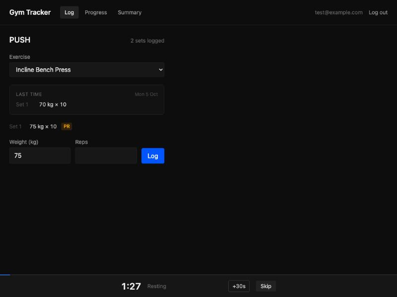
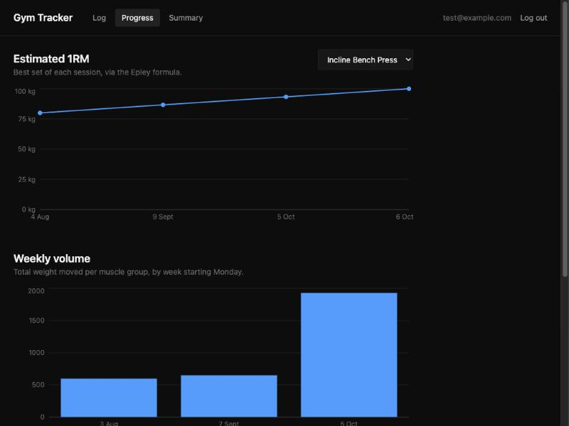

# Gym Progression Tracker

**[Live app →](https://gym-tracker-eosin-nine.vercel.app)**

A full-stack web app for logging gym sessions and seeing whether you're actually
getting stronger. Built around a 4-day Push / Pull / Legs / Upper split with
pyramid loading — every set is its own record, so the app can tell you what you
lifted last time and whether today beat it.

> Hosted on free tiers, so the first request after a quiet spell takes 30–60
> seconds while the server and database wake up. Sign up with any email —
> accounts are self-contained and nothing is sent anywhere.



Mid-set, the screen answers the only question that matters: *what did I do last
time, and did I beat it?* The rest timer starts itself the moment a set lands.

---

## What it does

- **Per-set logging.** Weight, reps and optional RPE for every set, not a
  per-exercise summary — pyramid sets need the granularity.
- **"Last time" panel.** Shows the same exercise's previous session while you log.
- **PR badges.** A set that beats your all-time estimated 1RM is flagged as you
  log it; one that beats only the last session shows the gain instead.
- **Progress charts.** Estimated 1RM per exercise over time, and weekly training
  volume broken down by muscle group.
- **Weekly summary.** At the end of each week: sessions hit versus planned,
  volume against the week before, new records, and how many sets improved.
- **Bodyweight tracking** alongside the lifts.
- **Rest timer** with presets, and **installable as a PWA** on a phone.




---

## Stack

| Layer | Choice |
|---|---|
| Frontend | React 19, Vite, TypeScript, TailwindCSS, recharts, react-router |
| Backend | Node, Express, TypeScript |
| Database | PostgreSQL via Prisma |
| Auth | bcrypt + JWT |
| Tests | Vitest — 52 across both halves |

---

## Architecture

The point of the project was a real client → API → database → auth chain, not a
frontend with mock data. Two conventions hold it together.

**Domain logic is pure and lives in `lib/`.** `estimate1RM`, `weeklyVolume` and
`weeklySummary` take data in and return data out. No database, no HTTP, no
reading the clock — a week-start date is passed in rather than derived from
`new Date()`. They were written and tested before any database existed, and
they're the part of the codebase most likely to still be correct in a year.

**Route handlers own data access.** Prisma queries live there, scoped by the
`userId` from the JWT. A function that does maths *and* touches the database
gets split.

That split is why the same `weeklySummary` runs unchanged on the server and in
the browser, and why the charts needed no new endpoints — they're computed on the
client from the raw sets.

```
backend/src/
  lib/           pure logic + tests
  routes/        one router per resource
  middleware/    JWT verification
frontend/src/
  lib/           mirrors backend/lib, plus chart transforms
  api/           fetch wrappers, one per resource
  components/
```

---

## Running it locally

**You'll need** Node 22+ and a Postgres database. [Neon](https://neon.tech)'s free
tier is enough.

```bash
git clone https://github.com/clementchew2004/GymTracker.git
cd GymTracker
```

**Backend**

```bash
cd backend
npm install
cp .env.example .env          # then fill in DATABASE_URL and JWT_SECRET
npx prisma migrate deploy     # create the tables
npx prisma db seed            # 20 exercises + a test account
npm run dev                   # http://localhost:4000
```

Generate a JWT secret with `openssl rand -hex 32`.

The seed prints a test login — `test@example.com` / `testpassword123`.

**Frontend**

```bash
cd frontend
npm install
cp .env.example .env          # VITE_API_URL=http://localhost:4000
npm run dev                   # http://localhost:5173
```

**Tests**

```bash
cd backend && npm test        # 27
cd frontend && npm test       # 25
```

---

## Deploying

Three pieces, three places: static host for the frontend, application host for
the backend, managed Postgres for the data. This one runs on Vercel, Render and
Neon respectively, all on free tiers.

**Backend** — set `DATABASE_URL`, `JWT_SECRET` and `CORS_ORIGIN` (your frontend's
URL) in the platform's dashboard. Build with `npm run build`, start with
`npm start`, which runs `prisma migrate deploy` before booting so the production
schema is always current.

**Frontend** — set `VITE_API_URL` to the deployed backend URL. It's baked in at
build time, so changing it needs a rebuild, not a restart.

The four things that break a first deploy, in the order people hit them:

1. `.env` isn't deployed — every variable must be re-entered in the dashboard.
2. Anything pointing at `localhost` stops working.
3. CORS rejects the new frontend origin until you add it.
4. The production database starts empty; migrations must run as part of deploy.

---

## Decisions worth explaining

**Day types are strings, not an enum.** The schema originally had
`enum DayType { PUSH PULL LEGS UPPER }`. That worked while I was the only user,
and broke the moment friends wanted to use it — a Bro Split or Upper/Lower
doesn't fit four fixed values. Each user now stores their own `plannedDayTypes`,
and the weekly summary reports against *their* plan. The cost is losing database-
level validation of day names; the gain is that the app fits anyone's programme
without a migration.

**Charts compute on the client.** There are no stats endpoints. `GET /api/sessions`
returns raw sets and the browser derives 1RM curves and volume from them. Fewer
endpoints, and the same pure functions serve a future mobile client. It would stop
scaling at a few thousand sets per user — at which point the fix is server-side
aggregation, not a rewrite, because the maths is already isolated.

**The PWA installs but doesn't log offline.** The app shell is precached, so it
opens on a home screen without a network. API calls are deliberately *not* cached:
a stale workout log is worse than an honest failure. True offline logging needs an
IndexedDB outbox and sync-on-reconnect, which is a real feature rather than a
config change — deferred rather than half-done.

**A test suite that passes proves less than you'd think.** `estimate1RM` had
`if (weight === 100)` where it meant `if (reps === 1)`. All three tests passed,
because the only single-rep case they covered happened to use 100 kg. The function
was wrong everywhere else — `estimate1RM(100, 10)` returned 100 instead of 133.3 —
and it would have corrupted every point on the 1RM chart. The fix was two more
tests that fail against the old implementation.
